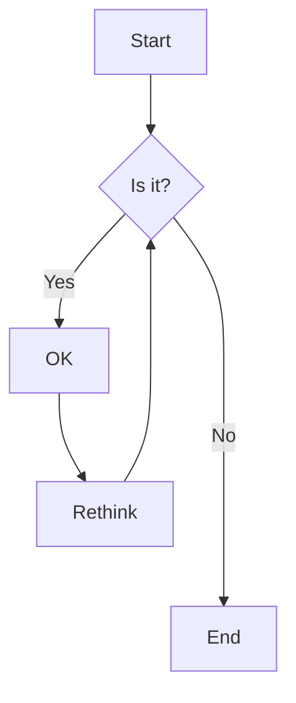

# Collaboration Primer

This is a public GitHub repository and [Project board](https://github.com/users/tiffehr/projects/1/views/1), which should grow to include a (Github Pages?) mini-site for my Capstone project for [CUNY Newmark J-School's 2022 Executive Program in News Innovation and Leadership](https://www.journalism.cuny.edu/j-plus/executive-program/).

## Effective Pitch Resources for Cross-Newsroom Collaboration

### Summary

**Challenge:**  Intra-newsroom collaborations offer many advantages to newsrooms small and large.  But many of our core journalistic defensive mechanisms — exclusivity and budgetary — need to be overcome and set aside with a serious, multi-faceted pitch.  The more we can set early expectations and focus on key decisions, the easier it is to get approval to explore collaborative projects, in words, data or more.

**Goal:**  A flow-chart-style set of recommended guidelines for cross-newsroom collaborations, designed to help formulate a solid internal pitch to bosses across many axes.  Those may include project-development facets like team shape and size, roles & responsibilities, cross-publication & crediting, values & cultural-alignment agreements, financial & potential return-on-investment and a tactical reporting cadence.

**Solution:** In collaboration with peers in differently shaped newsrooms, I will work on a primer for a collaboration-oriented pitch to a masthead editor (and by extension budgets, finance and staffing). A flow-chart of options could build out a simple or multi-part pitch, with many considerations answered up front that may not be traditionally expected by an editor. Grounding the process in project-management and/or product-development thinking should help show a well-rounded approach.

### [WIP] Initial Pitch-Crafting Decisions

